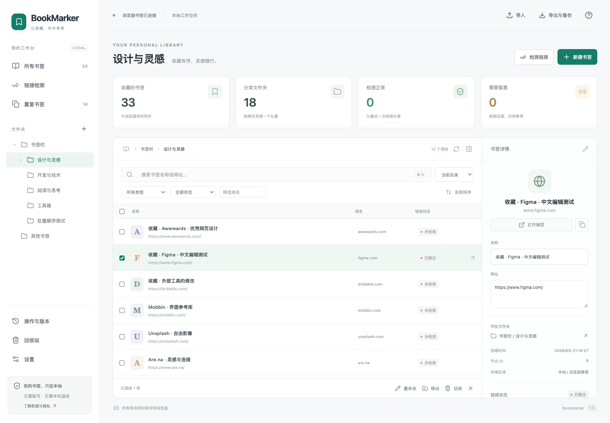

# BookMarker · 书签工作台

直接管理当前浏览器书签的 Manifest V3 扩展，使用 React、TypeScript、Vite。支持 Chrome / Edge，最低 Chromium 134；无需本机服务。



## 安装

从 [v1.0.0 Release](https://github.com/hidge123/BookMarker/releases/tag/v1.0.0) 下载 **`BookMarker-1.0.0.zip`** 并解压。同页提供 SHA-256 校验文件；不要将 GitHub 自动生成的 `Source code` 压缩包当作可直接安装的扩展。

从源码构建时，先执行 `npm ci` 和 `npm run package`，扩展会生成在 **`dist/`**，分发包位于 **`releases/BookMarker-1.0.0.zip`**。

1. Chrome 打开 `chrome://extensions`；Edge 打开 `edge://extensions`。
2. 开启「开发者模式」，点击「加载已解压的扩展程序」。
3. 选择本项目的 `dist` 文件夹，或 ZIP 解压后直接包含 `manifest.json` 的文件夹。
4. 点击扩展图标打开书签工作台。日后点击图标会优先定位已经打开的工作台标签页。

完整步骤和权限说明见 [安装说明](docs/INSTALL.md)，数据范围和故障处理见 [使用与诊断](docs/USAGE.md)。第一版不包含商店发布。

版本变更见 [更新日志](CHANGELOG.md)。

## 已实现

- 文件夹树、虚拟化列表、详情编辑、拖拽移动与排序、右键菜单、勾选 / Cmd / Ctrl / Shift 多选。
- 书签和文件夹创建、批量移动 / 回收 / 重命名预览，名称、URL、域名、类型、状态筛选。
- 完整 URL 精确去重，可选择保留副本并查看原路径。
- 来源书签区域内的可见回收站，保留节点 ID 的恢复；永久删除和清空需要确认。
- 串行写入、逐步操作日志、提交前冲突检查、中断核对、撤销重做、版本回滚和自动快照。
- HTML、Chromium `Bookmarks` JSON、Firefox 未压缩 JSON 的导入预览；原始字节、SHA-256 和额外元数据保留。
- UTF-8 HTML 导出、完整项目 ZIP 下载和恢复预览。跨配置恢复创建新节点，并映射回收站位置。
- 可恢复检测队列、按需权限、并发限制、HEAD / 限量 GET、真实网络错误与跳转信息、取消和重测。

所有管理操作即时写入浏览器。固定根目录与受管理节点受到后台和界面的双重保护。回收站默认排除在普通搜索、去重、检测和 HTML 导出之外。

## 开发与验证

本次使用 Node.js 26.8.1 和 npm 11.19.0。依赖由 `package-lock.json` 锁定。

```sh
npm ci
npm run typecheck
npm test
npm run package
npm run test:integration
```

`npm run dev` 只启动安装预览页；书签功能必须在扩展环境使用。实际调试时运行 `npm run build`，然后在浏览器扩展页点击重新加载。

集成测试默认使用 macOS `/Applications` 中的 Chrome 和 Edge。脚本为每次测试创建独立临时配置；不会访问现有个人浏览器配置。使用 DevTools pipe 加载扩展，无需修改真实浏览器的开发者设置。移植到其他系统时修改 `scripts/integration.mjs` 的浏览器可执行文件路径。

验收证据见 [测试报告](docs/QA.md) 和 `test-results/integration-report.json`。核心架构、恢复策略和已知边界见 [架构说明](docs/ARCHITECTURE.md)。

## 目录

| 路径 | 内容 |
| --- | --- |
| `src/background.ts` | 消息路由、事件、alarms 与任务调度 |
| `src/engine.ts` | 书签修改、冲突、日志、恢复、快照与回滚 |
| `src/checker.ts` | 网络检测、请求关联、队列与诊断 |
| `src/formats.ts` | 导入解析、无损原件、HTML 与 ZIP |
| `src/store.ts`、`src/transfers.ts` | IndexedDB 与大文件传输 |
| `src/ui/` | 管理界面与虚拟列表 |
| `tests/`、`scripts/integration.mjs` | 单元与真实扩展集成测试 |
| `docs/PLAN.md` | 用户提供的原实施计划副本 |

不请求代理、历史记录、网页脚本注入或云端同步权限。检测会向所选站点发送无登录凭据的网络请求，使用浏览器适用的网络配置；浏览器已有的书签同步仍由浏览器设置决定。
